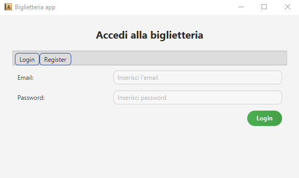
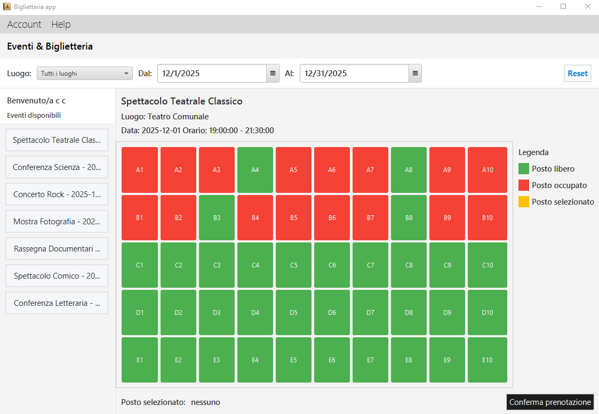
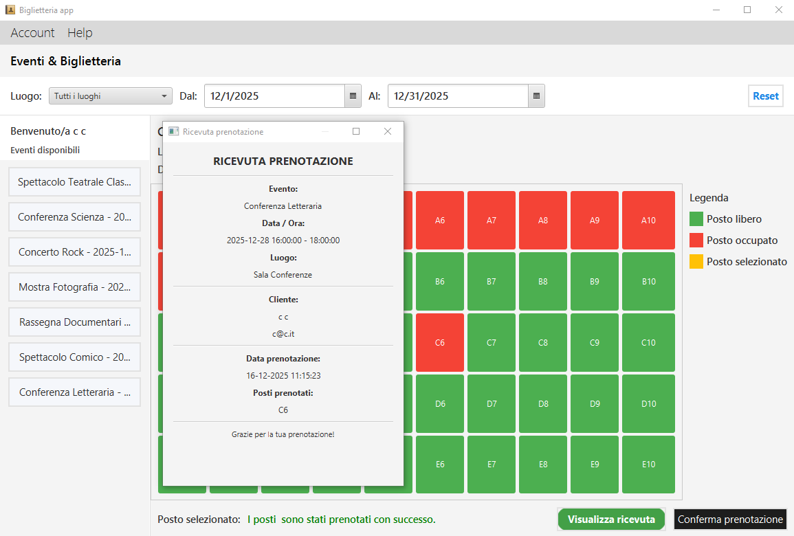
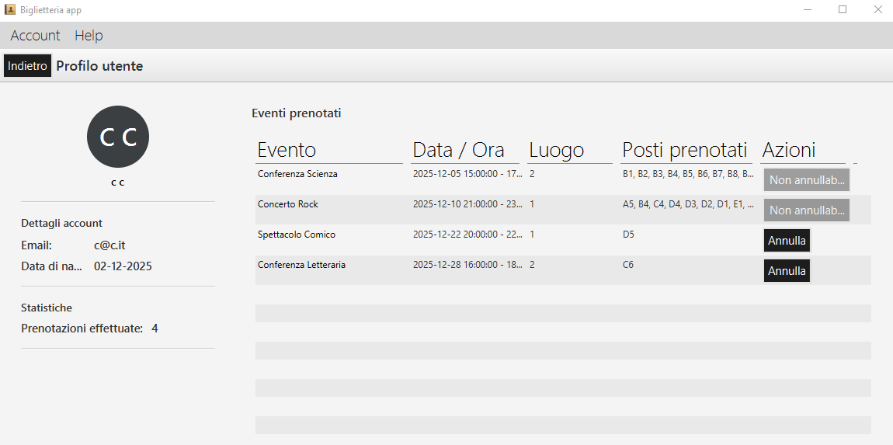
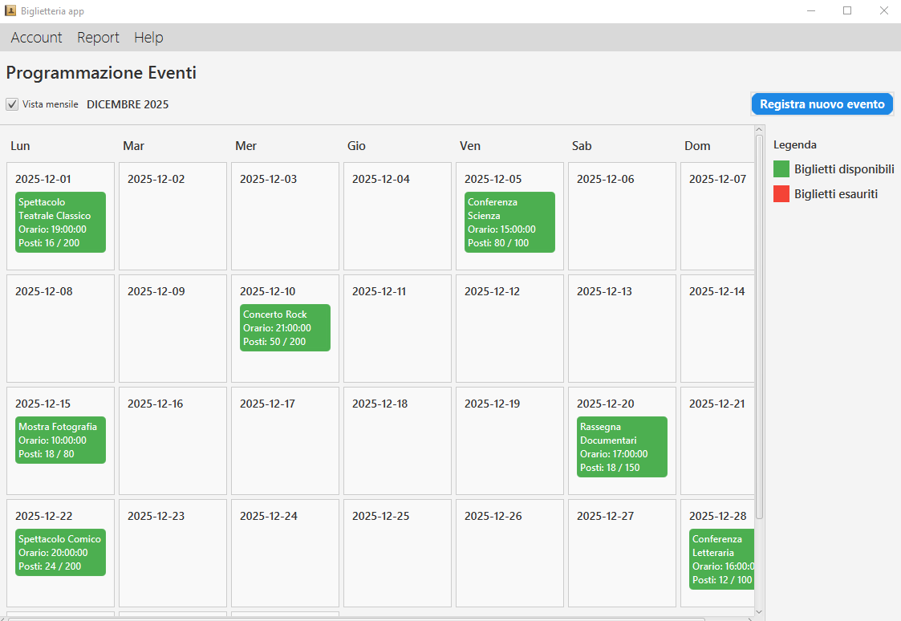
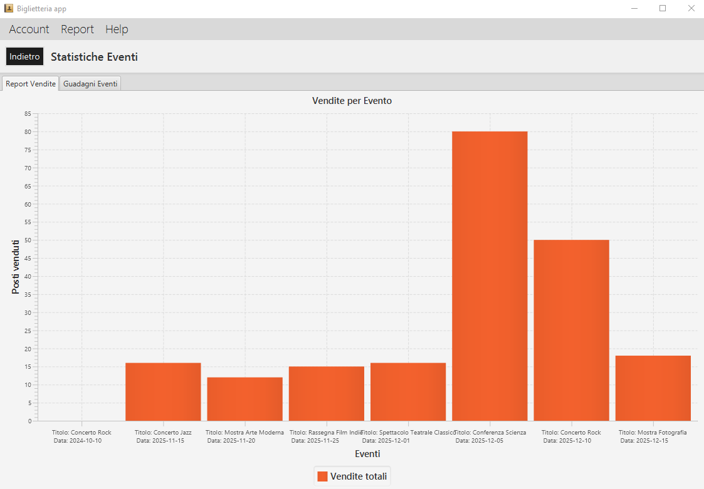

# 🎟️ Sistema di Biglietteria (Software Engineering - Gruppo 9)

**Progetto sviluppato per l'esame di Software Engineering dell'Università di Cassino.**

L'applicazione mira a **gestire la vendita e la prenotazione di biglietti per eventi**, consentendo sia ai clienti di consultare e acquistare posti, sia alle organizzazioni autorizzate di inserire e monitorare gli eventi.

---

## ✨ Funzionalità Dettagliate

### 1. 🔑 Accesso e Autenticazione

L'accesso all'applicazione è gestito tramite una schermata di **Login/Register**. Gli utenti possono accedere inserendo la propria Email e Password, oppure procedere alla registrazione di un nuovo account.



### 2. 👤 Funzionalità Lato Cliente

Una volta effettuato l'accesso, l'utente può gestire le proprie prenotazioni.

#### A. Consultazione Eventi e Prenotazione Posti

* **Visualizzazione Eventi:** Il cliente può navigare tra gli eventi disponibili, con possibilità di filtraggio per luogo e intervallo di date.
* **Selezione Posti:** Viene mostrata una mappa dettagliata dei posti per l'evento selezionato. La **Legenda** distingue chiaramente i posti **liberi** (verde), **occupati** (rosso) e **selezionati** (giallo).



* **Ricevuta di Prenotazione:** Dopo la conferma, viene generata una ricevuta con tutti i dettagli essenziali (Evento, Data/Ora, Luogo, Posti prenotati).



#### B. Profilo Utente e Gestione Prenotazioni

* **Dettagli Account e Statistiche:** Il profilo utente riassume i dettagli e il numero totale di prenotazioni effettuate.
* **Gestione Azioni:** Il cliente può visualizzare l'elenco dei propri eventi prenotati ed eseguire azioni come **Annulla** (quando permesso) o notare le prenotazioni con azione **Non annullabile...**. È prevista anche una funzione di **Lista d'attesa**.



### 3. 🏢 Funzionalità Lato Organizzazione (Operatore)

L'operatore ha strumenti dedicati per la gestione degli eventi e il monitoraggio delle vendite.

#### A. Programmazione Eventi

* **Calendario Eventi:** Una vista mensile offre una panoramica chiara degli eventi programmati. Ogni casella mostra Titolo, Orario e la situazione dei posti (disponibili/totali).
* **Gestione:** È presente la funzione per **"Registra nuovo evento"**.



#### B. Statistiche e Report Vendite

* **Report Vendite per Evento:** Il report "Statistiche Eventi" fornisce una chiara visualizzazione delle performance di vendita tramite un **Grafico a Barre** che mostra i "Posti venduti" per ciascun evento.



---

## 💻 Architettura e Tecnologie

Il sistema è basato su un'architettura **MVC** e utilizza il pattern **DAO** per la persistenza dei dati.

* **Linguaggio:** Java
* **UI Framework:** JavaFX (tramite FXML + Controller)
* **Database:** MySQL (persistenza dati)
* **Librerie:** JDBC: `mysql-connector-java-8.0.27.jar`
* **Testing:** JUnit (test presenti, richiedono DB configurato)

### Struttura del Repository


## Struttura del repository

```text
.
├── src/                      # Sorgenti Java + FXML + Controller
│   └── it/unicas/...          # Package applicazione
├── resources/                # Asset (icone)
├── lib/                      # Dipendenze (MySQL connector)
├── build/ bin/ out/           # Output
├── .idea/                    # Configurazione IntelliJ
└── README.md


